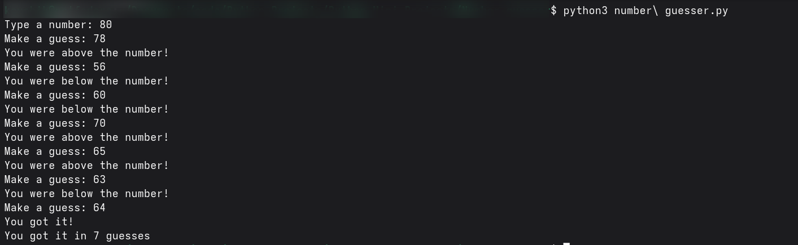

# 🐍 Number Guesser

---

## 🎯 What It Does

- Combines input and logic to perform a small task.  
- Introduces Python functions and basic operations.

---

## 🧠 How It Works

- Prompts user for input values.  
- Uses Python logic, loops or functions.  
- Displays results interactively.

---

## 📚 Things Learned

- Function definition and calling  
- Basic input validation  
- Working with Python data types

---

## 🖼 Screenshot

---

**README file:** Done with the help of ChatGPT 🤖
