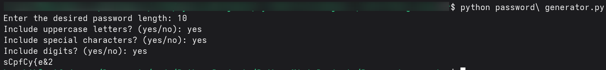

# 🐍 Password Generator

---

## 🎯 What It Does

Describe in your own words what this project does:
- Purpose and behavior of the program
- How a user interacts with it

---

## 🧠 How It Works

Break down the core logic:
- Python constructs used (e.g., lists, functions, conditionals)
- Brief explanation of how it works

---

## 📚 Things Learned

- New concepts learned while building this project
- Python skills you practiced
- Any libraries or tools you used

---

## 🖼 Screenshots
**Example Output:**

---

## 📜 Credits

- **Video Credits:** [Python Beginner Project Tutorial - Turtle Racing! by Tech with Tim](https://www.youtube.com/watch?v=gQP0geNsO4A)  
- **README file:** Done with the help of ChatGPT 🤖  

---
