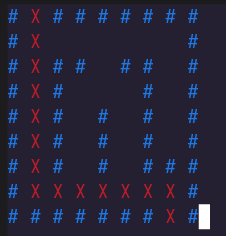

# 🐍 Path Finder

---

## 🎯 What It Does

Describe in your own words what this project does. For example:  
- What input does it take?  
- What output does it produce?  
- What problem or behaviour does it demonstrate?

---

## 🧠 How It Works

Explain the core logic:
- Key Python concepts used (e.g., loops, functions, classes)
- How data flows through the program
- Any modules or libraries used

---

## 📚 Things Learned

- Python concepts practiced
- Any new libraries or techniques you hadn’t used before
- What you enjoyed or found challenging

---

## 🖼 Screenshots

---

## 📜 Credits

- **Video Credits:** [3 Mini Python Projects - For Intermediates by Tech with Tim](https://www.youtube.com/watch?v=txKBWtvV99Y)  
- **README file:** Done with the help of ChatGPT 🤖  

---
