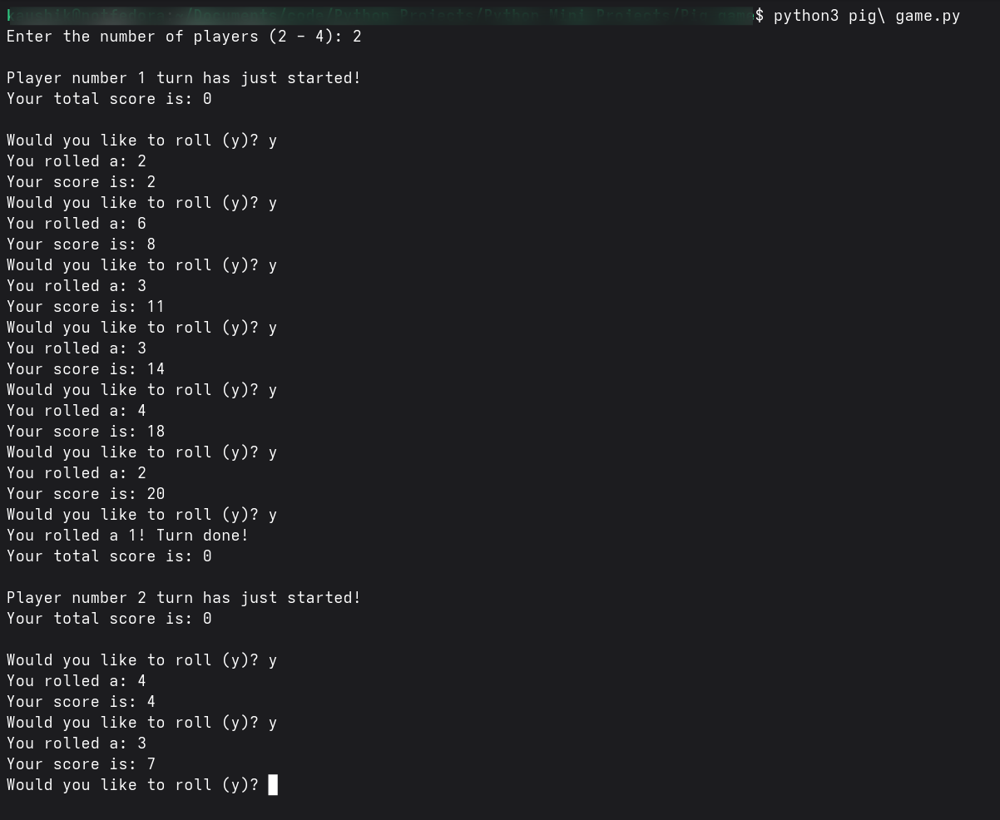

# 🐍 Project 1 – Pig Game

*A simple Python project built to practice Python basics like input, output, loops, and conditionals.*  

---

## 🎯 How It Works

- The program takes user input and performs basic logic or calculations.  
- Demonstrates conditionals (`if/else`) and loops (`for` or `while`).  
- Outputs results or messages based on the user’s input.  

---

## 📚 Things Learned

- Python syntax and basic programming structure  
- Handling user input  
- Using loops and conditionals  
- Printing outputs and feedback  

---

## 🖼 Screenshot

---

**README file:** Done with the help of ChatGPT 🤖
