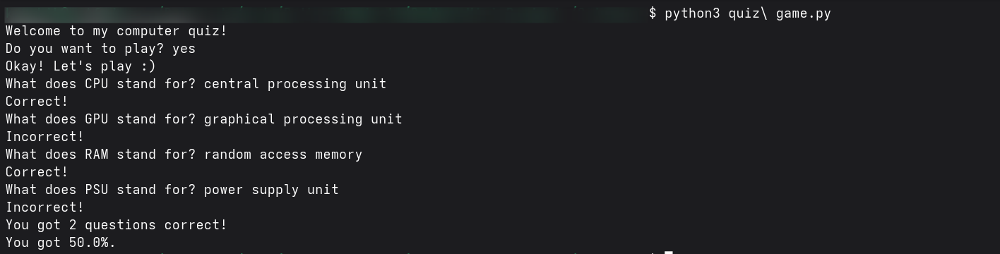

# 🐍 Quiz Game

---

## 🎯 What It Does

- A small interactive Python program using basic Python features.  
- Demonstrates conditionals, loops, input/output, and basic logic.

---

## 🧠 How It Works

- Takes user input from the terminal.  
- Applies simple logic or calculations.  
- Outputs feedback or results.

---

## 📚 Things Learned

- Python syntax and control flow  
- Handling user input  
- Basic data processing  
- Producing console outputs

---

## 🖼 Screenshot

---

## 📜 Credits

- **Video Credits:** [5 Mini Python Projects - For Beginners by Tech with Tim](https://www.youtube.com/watch?v=DLn3jOsNRVE)  
- **README file:** Done with the help of ChatGPT 🤖  

---
