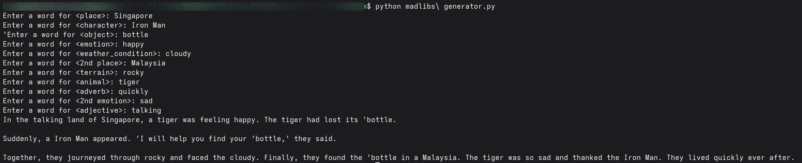

# 🐍 Story Program

---

## 🎯 How It Works

- The program interacts with the user via input prompts.  
- Implements logical decisions and simple calculations.  
- Provides feedback or output based on the user’s choices.  

---

## 📚 Things Learned

- Control flow using `if`, `elif`, `else`  
- Processing user input  
- Implementing basic logic and functions  
- Structuring a simple interactive program  

---

## 🖼 Screenshot

---

## 📜 Credits

- **Video Credits:** [3 Mini Python Projects - For Beginners by Tech with Tim](https://www.youtube.com/watch?v=21FnnGKSRZo)  
- **README file:** Done with the help of ChatGPT 🤖  

---
