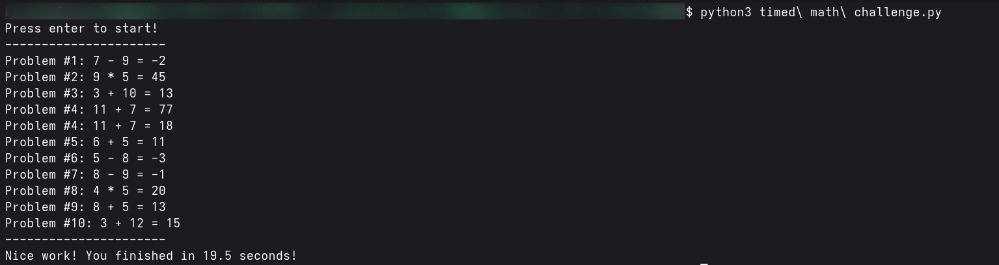

# 🐍 Timed Math Challenge

*A slightly more engaging Python project combining logic, loops, and interactive output.*  

---

## 🎯 How It Works

- Takes user input and runs a small interactive program.  
- Combines concepts from Project 1 & 2 (loops, conditions, and output).  
- Displays results or fun messages based on user input.  

---

## 📚 Things Learned

- Combining loops and conditionals for practical tasks  
- Writing more structured and interactive Python programs  
- Problem-solving and applying previous concepts together  
- Running and testing Python scripts  

---

## 🖼 Screenshot

---

## 📜 Credits

- **Video Credits:** [3 Mini Python Projects - For Beginners by Tech with Tim](https://www.youtube.com/watch?v=21FnnGKSRZo)  
- **README file:** Done with the help of ChatGPT 🤖  

---
